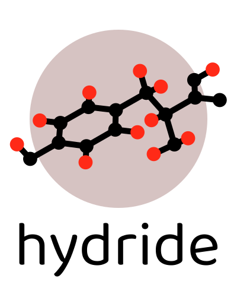
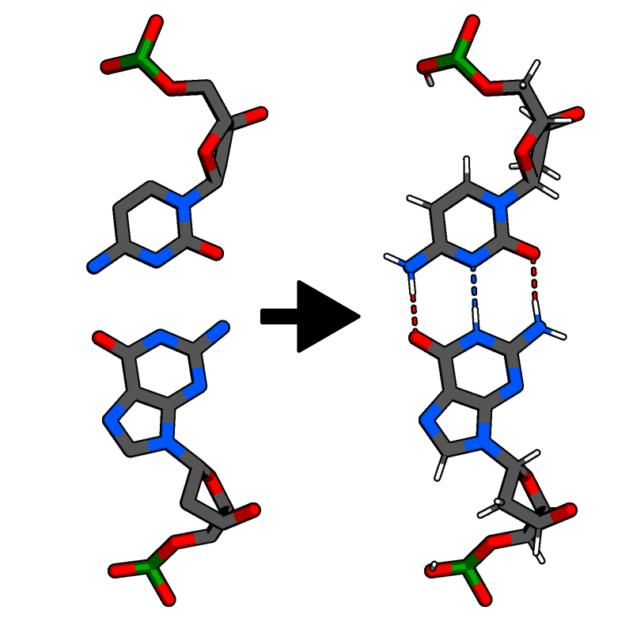

Hydride - Adding hydrogen atoms to molecular models
===================================================

Many tasks in structural biology ranging from simulations and hydrogen
bond detection to mere visual analysis, require complete molecular
models.
However, most experimentally determined structures do not include
the position of hydrogen atoms, due to their small size and electron
density.

*Hydride* is an easy-to-use program and library written in Python that
adds missing hydrogen atoms to molecular models based on known bond
lengths and angles.
Since it does not require force-field parameters for the specific
molecule(s), it can be used for adding hydrogen atoms to almost any
organic molecule - from small ligands to large protein complexes.

|

Installation
------------

In order to use *Hydride* you need to have Python (at least 3.7) installed.

You can install *Hydride* via

.. code-block:: console

   $ pip install hydride

Usage
-----

In its basic invocation *Hydride* reads an input structure file, adds hydrogen
atoms to the molecular model and writes the resulting model into an output
structure file.

.. code-block:: console

   $ hydride -i input_structure.pdb -o output_structure.pdb

Python API
----------

*Hydride* also provides a Python API to add hydrogen atoms to ``AtomArray``
objects from `Biotite <https://www.biotite-python.org/>`_.

.. code-block:: python

   atom_array, _ = hydride.add_hydrogen(atom_array)
   atom_array.coord = hydride.relax_hydrogen(atom_array)
